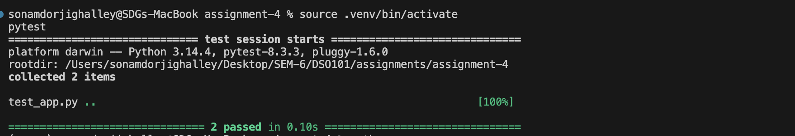
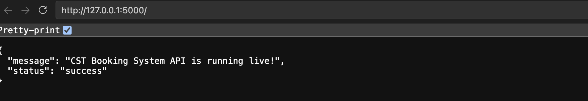
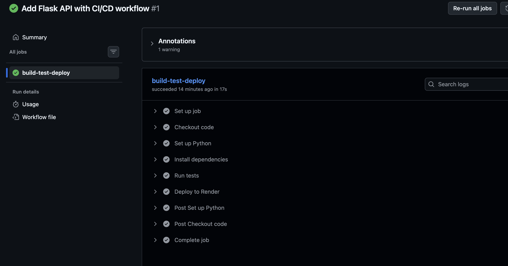
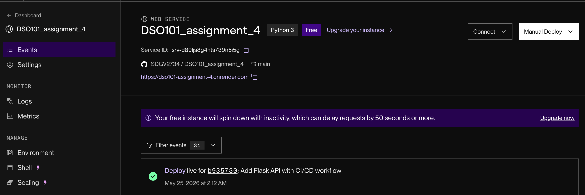

# Assignmwent 4 Report

## Project Overview

The System API is a lightweight Flask-based backend application developed as part of a software deployment and automation assignment. The project demonstrates the implementation of a minimal web API, automated unit testing with Pytest, and a continuous integration and deployment workflow using GitHub Actions and Render.

The application currently provides a health-check style homepage endpoint that confirms the API is operational. Although the functional scope is intentionally small, the project follows a structure suitable for extension into a larger booking system backend.

## Objectives

The main objectives of this project are to:

- Develop a basic Flask backend application.
- Return a structured JSON response from the root API endpoint.
- Validate application behavior using automated Pytest test cases.
- Configure dependency management through `requirements.txt`.
- Implement a GitHub Actions workflow for automated testing.
- Trigger deployment to Render after successful tests on the `main` branch.

## Technology Stack

| Component | Technology |
|---|---|
| Backend Framework | Flask |
| Testing Framework | Pytest |
| Production Server | Gunicorn |
| CI/CD Platform | GitHub Actions |
| Cloud Deployment Platform | Render |
| Programming Language | Python |

## Project Structure

```text
project/
|-- app.py
|-- test_app.py
|-- requirements.txt
|-- .github/
    |-- workflows/
        |-- ci.yml
```

## Application Endpoint

The application exposes the following endpoint:

| Method | Endpoint | Description |
|---|---|---|
| GET | `/` | Returns the operational status of the API |

Expected JSON response:

```json
{
  "message": "CST Booking System API is running live!",
  "status": "success"
}
```

## Local Development Setup

Clone the repository and navigate into the project directory:

```bash
git clone <repository-url>
cd <repository-name>
```

Create a Python virtual environment:

```bash
python -m venv .venv
```

Activate the virtual environment:

```bash
source .venv/bin/activate
```

For Windows PowerShell:

```bash
.venv\Scripts\Activate.ps1
```

Install the required dependencies:

```bash
pip install -r requirements.txt
```

Run the Flask application locally:

```bash
python app.py
```

By default, the application runs at:

```text
http://localhost:5000
```

The application also supports dynamic port configuration through the `PORT` environment variable, which is required for deployment platforms such as Render.

## Running Tests

Automated tests are written using Pytest. To execute the test suite locally, run:

```bash
pytest
```

The tests verify that:

- The basic project testing structure is functional.
- The Flask root endpoint returns an HTTP `200 OK` response.
- The API returns the expected JSON payload.

## Continuous Integration and Deployment

This project includes a GitHub Actions workflow located at:

```text
.github/workflows/ci.yml
```

The workflow is triggered automatically whenever code is pushed to the `main` branch. It performs the following steps:

1. Checks out the repository source code.
2. Sets up Python version `3.9`.
3. Installs the dependencies listed in `requirements.txt`.
4. Runs the Pytest test suite.
5. Triggers deployment to Render using a deploy hook URL stored as a GitHub repository secret.

## GitHub Repository Secret Configuration

To enable automatic deployment to Render, the Render deploy hook URL must be stored securely in GitHub Actions secrets.

Steps:

1. Open the GitHub repository.
2. Navigate to `Settings`.
3. Select `Secrets and variables`.
4. Choose `Actions`.
5. Click `New repository secret`.
6. Enter the secret name as:

```text
RENDER_DEPLOY_HOOK_URL
```

7. Paste the Render deploy hook URL as the secret value.
8. Click `Add secret`.

This allows the GitHub Actions workflow to access the deploy hook without exposing sensitive information in the repository.

## Render Deployment Configuration

To deploy the application on Render:

1. Create a new Web Service on Render.
2. Connect the service to the GitHub repository.
3. Set the build command to:

```bash
pip install -r requirements.txt
```

4. Set the start command to:

```bash
gunicorn app:app
```

5. Ensure the service environment is configured for Python.
6. Copy the Render deploy hook URL and store it in GitHub as `RENDER_DEPLOY_HOOK_URL`.

Once configured, every successful push to the `main` branch will run the automated test suite and trigger deployment to Render.

## Evidence of Completion

This section can be used to include screenshots that demonstrate the project was implemented, tested, and deployed successfully. Replace the placeholder text with actual screenshots before final submission.


### Screenshot 1: Local Test Execution



### Screenshot 2: API Response in Browser or Postman



### Screenshot 3: GitHub Actions Workflow



### Screenshot 4: Render Deployment



## Conclusion

This project provides a concise demonstration of backend API development, automated testing, and deployment automation. The structure is intentionally simple, making it suitable for academic assessment while also providing a foundation for future expansion into a complete booking system.
